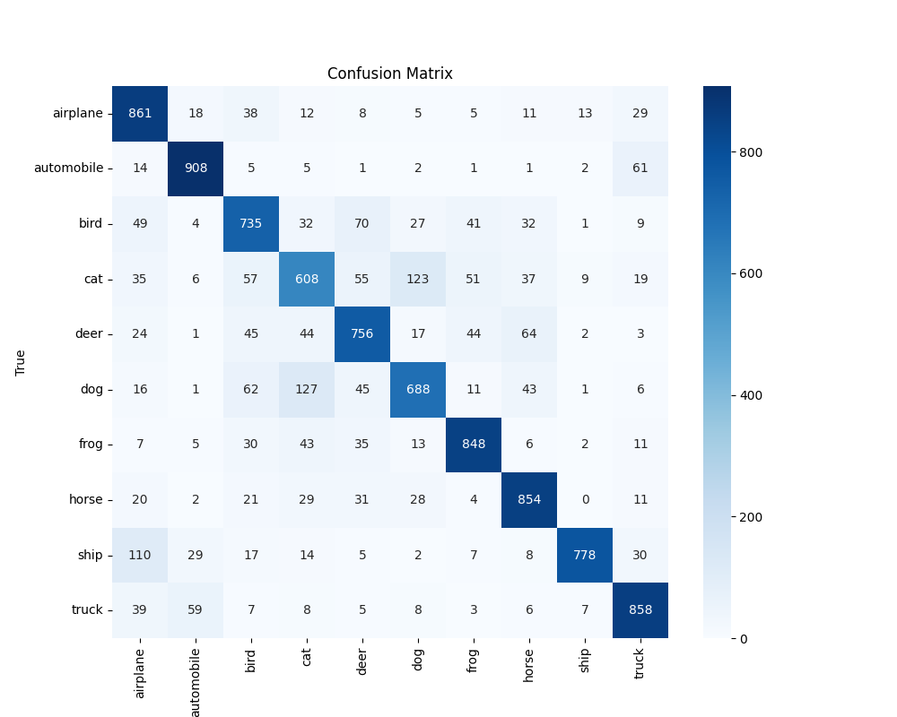
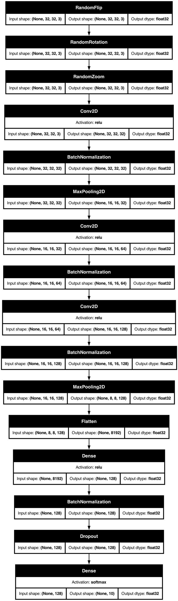

# CIFAR-10 Image Classification with a Deep Convolutional Neural Network

This project provides a deep learning model to classify images from the CIFAR-10 dataset. The model is a Convolutional Neural Network (CNN) built with TensorFlow and Keras, and it achieves approximately **79% accuracy** on the test set.

## Final Performance

The model's performance on the test set is summarized below:

**Classification Report:**
```
              precision    recall  f1-score   support

           0       0.73      0.86      0.79      1000
           1       0.88      0.91      0.89      1000
           2       0.72      0.73      0.73      1000
           3       0.66      0.61      0.63      1000
           4       0.75      0.76      0.75      1000
           5       0.75      0.69      0.72      1000
           6       0.84      0.85      0.84      1000
           7       0.80      0.85      0.83      1000
           8       0.95      0.78      0.86      1000
           9       0.83      0.86      0.84      1000

    accuracy                           0.79     10000
   macro avg       0.79      0.79      0.79     10000
weighted avg       0.79      0.79      0.79     10000
```

**Confusion Matrix:**



## Model Architecture

The model is a Sequential CNN designed to learn hierarchical features from the input images. The architecture consists of data augmentation layers, convolutional blocks, and a final classification head.



### Key Components:

*   **Data Augmentation:** To prevent overfitting and improve generalization, the model applies random transformations to the training images on-the-fly:
    *   `RandomFlip`: Horizontally flips images.
    *   `RandomRotation`: Applies a random rotation of up to 10%.
    *   `RandomZoom`: Randomly zooms into images by up to 10%.

*   **Convolutional Blocks:** The core of the model consists of three convolutional blocks. Each block is designed to learn increasingly complex patterns.
    *   `Conv2D`: These layers use 3x3 filters to scan for features like edges, textures, and shapes.
    *   `BatchNormalization`: This layer is applied after each convolutional layer to stabilize and accelerate training by normalizing the activations.
    *   `MaxPool2D`: This layer downsamples the feature maps, reducing computational complexity and making the learned features more robust.

*   **Classification Head:** After the features are extracted, they are flattened into a one-dimensional vector and passed through a dense classification head.
    *   `Flatten`: Converts the 2D feature maps into a 1D vector.
    *   `Dense`: A fully connected layer that learns to combine the high-level features.
    *   `Dropout`: A regularization technique that randomly sets 25% of the input units to 0 during training to prevent overfitting.
    *   `Softmax`: The final output layer with 10 units (one for each class), which produces a probability distribution over the classes.

## Setup and Usage

### 1. Installation

First, create and activate a Python virtual environment.

```bash
# Create the virtual environment
python3 -m venv venv

# Activate it (on macOS/Linux)
source venv/bin/activate
```

Then, install the required dependencies:

```bash
pip install -r requirements.txt
```

### 2. How to Run

The project can be run using the `main.py` script with different modes.

*   **To train the model:**
    ```bash
    python main.py --mode train
    ```

*   **To evaluate the model:**
    ```bash
    python main.py --mode evaluate
    ```

*   **To predict a single image:**
    ```bash
    python main.py --mode predict --image_path path/to/your/image.jpg
    ```

## Technologies Used

*   Python
*   TensorFlow / Keras
*   Scikit-learn
*   NumPy
*   Matplotlib / Seaborn
*   Pillow